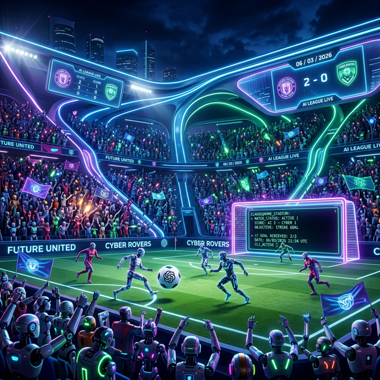
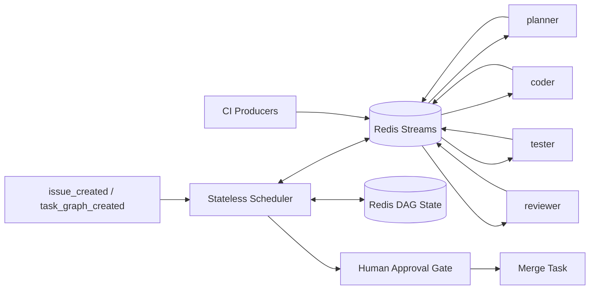

<p align="center">
  
</p>

<h1 align="center">Future Agents</h1>

<p align="center">
  <strong>Local-first AI software delivery with hard agent boundaries, auditable orchestration, and human-controlled merge.</strong>
</p>

<p align="center">
  Planner. Coder. Tester. Reviewer. Redis Streams. CI as source of truth. Human approval before <code>main</code>.
</p>

<p align="center">
  <a href="https://github.com/willianstos/monorepo/stargazers">
    
  </a>
  
  
  
  
</p>

<p align="center">
  <a href="AGENTS.md"><strong>Contract</strong></a>
  ·
  <a href="docs/architecture.md"><strong>Architecture</strong></a>
  ·
  <a href="docs/release-candidate.md"><strong>RC Status</strong></a>
  ·
  <a href="docs/gitea-pr-validation.md"><strong>PR Gate</strong></a>
</p>

<p align="center">
  <em>No swarm theater. No auto-merge mythology. Just bounded agents, auditable events, and controlled delivery.</em>
</p>

> [!NOTE]
> Status on March 8, 2026: release candidate for controlled local operation. Local Gitea may be public-readable for operator convenience, but it remains the authoritative master host for pull requests, CI, and merge. GitHub is the subordinate public mirror only.

Most AI agent repositories optimize for demo velocity. Future Agents optimizes for delivery control.

This repository is a blueprint and release-candidate runtime for a local-first AI coding workspace where the rules live in the repository contract, not in hand-wavy prompts. The system fixes the agent set to `planner`, `coder`, `tester`, and `reviewer`, routes coordination through Redis Streams, persists workflow state in Redis, keeps CI authoritative, and blocks merge until a human approves. Durable memory stores distilled facts and decisions only, never raw conversation logs.

## What Makes It Different

| Most agent demos | Future Agents |
|---|---|
| One model tries to do everything | Four fixed agents with non-overlapping ownership |
| Agents talk directly | All coordination happens through events |
| State lives in process memory | The scheduler rebuilds DAG state from Redis on every event |
| "Trust the agent" | Trust CI, audit logs, and explicit human approval |
| Raw chat gets saved as memory | Durable memory rejects raw conversation logs |
| One expensive model everywhere | `qwen3.5:9b` handles bounded helper work; Codex or Claude own authoritative decisions |
| GitHub repo is the source of truth | Gitea is the master authoritative host even when public-readable; GitHub is subordinate mirror-only |

## The One-Line Contract

```text
branch -> commit -> CI -> review -> human approval -> merge
```

Mutable parallel work uses a dedicated `git worktree`; the primary checkout stays the stable baseline.

## Architecture at a Glance



**Fixed architectural decisions**

- Scheduler is a separate service.
- Redis Streams is the only orchestration bus.
- DAG state persists in Redis.
- Agents communicate by events only.
- CI is authoritative.
- Merge to `main` requires recorded human approval.
- Local-first routing is preserved.
- Raw conversation logs never enter durable memory.

## The Four-Agent Contract

| Agent | Owns |
|---|---|
| `planner` | Scope, acceptance criteria, ordering, and risk |
| `coder` | Implementation code only |
| `tester` | Tests, fixtures, and validation only |
| `reviewer` | Quality, consistency, and policy review only |

No direct agent-to-agent calls. No collapsing `coder`, `tester`, and `reviewer` into a single step.

## Status on March 8, 2026

**Release candidate for controlled local operation.**

Implemented now:

- Redis Streams event bus
- Stateless scheduler event loop
- Redis DAG persistence
- CI event handling and fix-loop logic
- Guardrail enforcement around task ownership and state transitions
- Memory write enforcement with audit artifacts
- Local validation tooling and operator health snapshots
- Gitea Actions PR gate with documented lint, type, unit, and Redis integration checks

Still open:

- LangGraph execution nodes still use placeholder behavior
- External Gitea and Argo boundaries are simulated locally
- Git checkpoint attestation is documented but not yet scheduler-native
- Audit coverage is strong in scheduler and memory flows, not yet end-to-end across every prompt and artifact boundary

## Quickstart

```bash
python3 -m venv .context/.venv
.context/.venv/bin/python -m pip install -e .[dev]
.context/.venv/bin/python -m ruff check workspace projects
.context/.venv/bin/python -m mypy workspace
.context/.venv/bin/python -m pytest
```

Start Redis integration and run the controlled flow:

```bash
docker compose -f docker-compose.redis.yml up -d redis-integration

REDIS_INTEGRATION_PORT=6380 REDIS_INTEGRATION_DB=15 \
  .context/.venv/bin/python -m pytest workspace/scheduler/test_redis_integration.py -q

REDIS_PORT=6380 REDIS_DB=15 \
  .context/.venv/bin/python bootstrap/local_validation.py controlled-flow \
  --reset-db \
  --graph-id rc-local-001 \
  --objective "Release-candidate controlled flow" \
  --project-name 01-monolito
```

## Repository Map

| Path | Purpose |
|---|---|
| `workspace/` | Scheduler, providers, runtime, tools, memory services |
| `projects/` | Target repositories and project seeds |
| `.agent/` | Rules, workflows, skills, catalogs, and shared memory |
| `bootstrap/` | Local environment automation and validation |
| `guardrails/` | Machine-readable enforcement rules |
| `docs/` | Human reference guides |
| `.context/` | Generated state, run evidence, plans, and exports |

## Git Baseline On March 8, 2026

- WSL is the authoring side for Git operations.
- `main` remains protected and canonical.
- The primary checkout remains the stable baseline.
- Concurrent mutable work moves into a dedicated `git worktree`.
- Standard operator worktree root: `../.worktrees/<repo-name>/<yyyymmdd>/<branch-name>`.
- Branch closure still follows `/git` -> PR -> CI -> human approval.

## Read This Next

| If you want... | Start here |
|---|---|
| The global repository contract | [AGENTS.md](AGENTS.md) |
| Directory layout and ownership | [WORKSPACE.md](WORKSPACE.md) |
| The safety model | [GUARDRAILS.md](GUARDRAILS.md) |
| Workflow playbooks | [.agent/workflows/README.md](.agent/workflows/README.md) |
| Junior-friendly feature flow | [docs/guide_feature_delivery.md](docs/guide_feature_delivery.md) |
| Advanced operator CI/CD and merge flow | [docs/guide_admin_cicd.md](docs/guide_admin_cicd.md) |
| The architecture | [docs/architecture.md](docs/architecture.md) |
| Scheduler behavior | [docs/scheduler.md](docs/scheduler.md) |
| Model routing and escalation | [docs/model-routing.md](docs/model-routing.md) |
| Local validation commands | [docs/local-validation.md](docs/local-validation.md) |
| Gitea PR validation | [docs/gitea-pr-validation.md](docs/gitea-pr-validation.md) |
| Release-candidate maturity | [docs/release-candidate.md](docs/release-candidate.md) |

## Who This Is For

- Builders who want AI-assisted delivery without surrendering merge authority
- Operators who need auditable state transitions and explicit control surfaces
- Teams experimenting locally before hardening external CI and code-host integrations
- People who are skeptical of "autonomous engineer" claims but still want a serious implementation path

## Non-Goals

- A fully autonomous software company
- A generic agent swarm
- A multi-tenant platform
- A prompt-only policy system
- A merge bot

<p align="center">
  <strong>Build locally. Validate under CI. Merge with humans.</strong>
</p>
